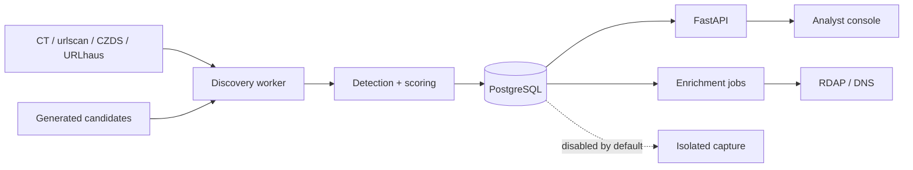

# MAegis

MAegis is an operational brand-abuse monitoring SaaS that discovers suspicious domains, produces reproducible evidence and risk scores, and gives analysts a structured triage queue. It is designed as a master's thesis and public engineering portfolio without pretending that a solo deployment has commercial passive-DNS coverage.


## Current milestone

The repository implements the first production-shaped vertical slice:

- multi-tenant protected-brand onboarding with legitimate-interest confirmation;
- targeted Certificate Transparency and passive urlscan metadata search, durably rotating DNS and RDAP candidate sweeps, URLhaus adapter, and streaming CZDS zone-file adapter;
- IDNA normalization, Unicode confusable checks, edit distance, shared-hosting and deceptive-subdomain detection, registry-wildcard suppression, deterministic scoring, and explicit score contributions;
- durable observations, candidates, incidents, evidence, connector checkpoints, audit events, and PostgreSQL jobs;
- tenant-scoped incident APIs and an interactive analyst console;
- API-backed incident evidence timelines, assignment, severity/status decisions, rationale capture, and audited triage;
- RDAP enrichment jobs and a separately containerized page-capture utility with SSRF controls;
- fail-soft A/AAAA/CNAME/MX/NS/TXT, RDAP, and TLS certificate enrichment with public-IP enforcement and deterministic rescoring;
- Docker Compose, CI, unit tests, health checks, and operational documentation.
- a hardened small-VM deployment profile with automatic TLS, internal-only PostgreSQL, resource limits, restart policies, durable worker heartbeats, and verified database backups.

Generated lookalikes cover alternate TLDs, omissions, duplications, transpositions, keyboard substitutions and insertions, ASCII and Unicode/IDNA homoglyphs, vowel substitutions, affixes, pluralization, hyphenation, and brand-keyword combinations. Every bounded sweep reserves capacity for exact-brand, lure-keyword, and Unicode candidates while continuing a rotating background scan across the remaining mutation families. Durable brand and candidate cursors resume after worker restarts, and one failed DNS or RDAP lookup cannot block later candidates. RDAP checks identify registrations before DNS or web content appears and emit only candidates inside the configurable freshness window (90 days by default).

The analyst feed merges a newest-findings lane with the highest-risk lane before deduplication, so fresh medium-risk registrations are not hidden behind an older high-risk backlog.

The near-zero-cost defaults generate at most 750 candidates per brand and check 20 RDAP candidates per selected brand per cycle. Tune `MAEGIS_MAX_GENERATED_CANDIDATES`, `MAEGIS_DISCOVERY_RDAP_BATCH_SIZE`, and `MAEGIS_FRESH_REGISTRATION_MAX_AGE_DAYS` to match the public RDAP service's limits. Registered domains without a usable registration event, old registrations, and unregistered candidates remain outside the fresh-registration incident path.

Live connectors are intentionally best effort. CZDS files require approved access, URLhaus requires an auth key, public RDAP services enforce rate limits, and the included CT search adapter should be replaced by a dedicated checkpointed CT monitor as volume grows.

## Architecture



The control plane is a modular monolith. Discovery and page capture run independently because their dependencies and failure modes differ. A transactional job table provides durable work without adding Kafka or Redis to the first release.

## Run locally

1. Copy `.env.example` to `.env` and replace the development API key.
2. Start the stack:

   ```bash
   docker compose up --build
   ```

3. Open the analyst console at `http://localhost:3000` and API documentation at `http://localhost:8000/docs`.

The web console is also available without Docker using `pnpm dev`. The API requires Python 3.12 and PostgreSQL.

### Register a monitored brand

```bash
curl -X POST http://localhost:8000/api/v1/brands \
  -H "Content-Type: application/json" \
  -H "X-API-Key: development-only" \
  -d '{
    "name": "Example Company",
    "official_domains": ["example.com"],
    "trademarks": ["Example"],
    "keywords": ["login", "support"],
    "permitted_variations": [],
    "legitimate_interest_confirmed": true
  }'
```

The discovery worker polls enrolled brands and retains only relevant observations. Put approved `*.zone.gz` files under `data/czds/`; full zone contents are streamed and are not inserted into PostgreSQL.

### Enroll the Romanian operational catalog

MAegis includes a reviewed catalog of 32 high-value Romanian and Romanian-international brands. It spans banking, energy, technology, retail, logistics, healthcare, aviation, property, and manufacturing. Official domains are allowlisted assets; inclusion does not imply that abuse has occurred.

Enroll every catalog brand idempotently for the default tenant:

```bash
docker compose exec api python -m app.seed_brands
```

Use `--paused` to prepare the records without live polling, or repeat `--brand KEY` to enroll a subset. The equivalent administrator API is `GET /api/v1/brand-catalog` followed by `POST /api/v1/brand-catalog/enroll` with legitimate-interest confirmation. To respect a small operational budget, discovery rotates through five brands every 15 minutes by default; both values are configurable with `MAEGIS_DISCOVERY_BRAND_BATCH_SIZE` and `MAEGIS_DISCOVERY_POLL_INTERVAL_SECONDS`.

### Submit a live finding manually

```bash
curl -X POST http://localhost:8000/api/v1/submissions \
  -H "Content-Type: application/json" \
  -H "X-API-Key: development-only" \
  -d '{"brand_id":"BRAND_ID","value":"example-login.com","request_capture":false}'
```

The response contains the normalized domain, risk, confidence, severity, detector version, and every score contribution.

The enrichment worker stores each DNS, RDAP, and TLS result independently. Retrieve the evidence timeline with `GET /api/v1/incidents/{id}/evidence`. DNS records pointing to non-public space remain visible as evidence, but MAegis will not establish a TLS connection to those addresses.

For an operational deployment, use `deploy/compose.production.yml` and follow [the operations runbook](docs/operations.md). The analyst console only displays a live-scanner state after the authenticated worker heartbeat proves a recent completed or running discovery cycle.

## Safety defaults

- Page capture is disabled unless `MAEGIS_CAPTURE_ENABLED=true`.
- Public, private, loopback, link-local, reserved, credential-bearing, non-HTTP, and nonstandard-port targets are rejected.
- Redirects and subresources are validated independently.
- Capture does not enter credentials, submit forms, accept downloads, or preserve sessions.
- Detection is evidence, not an accusation. Analyst confirmation and takedown remain manual.
- Tenant scope is applied server-side to operational queries.

Read [the architecture decisions](docs/architecture.md), [threat model](docs/threat-model.md), and [operations runbook](docs/operations.md) before enabling live monitoring.

## Tests

```bash
pnpm test
python -m unittest discover -s services/api/tests
python -m unittest discover -s services/capture -p "test_*.py"
```

CI additionally validates linting and container definitions.

## Roadmap

The next implementation increments are DNS record enrichment, API-backed console mutations, full evidence timelines, campaign clustering, OIDC enforcement, OpenAI-compatible grounded analysis, analyst feedback capture, notifications, and signed evidence exports. Commercial passive DNS, Kafka, Kubernetes, and automated takedown are deliberately outside the initial milestone.
